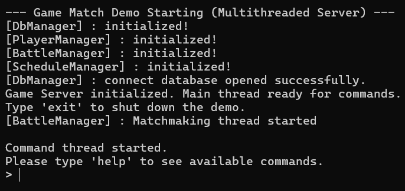
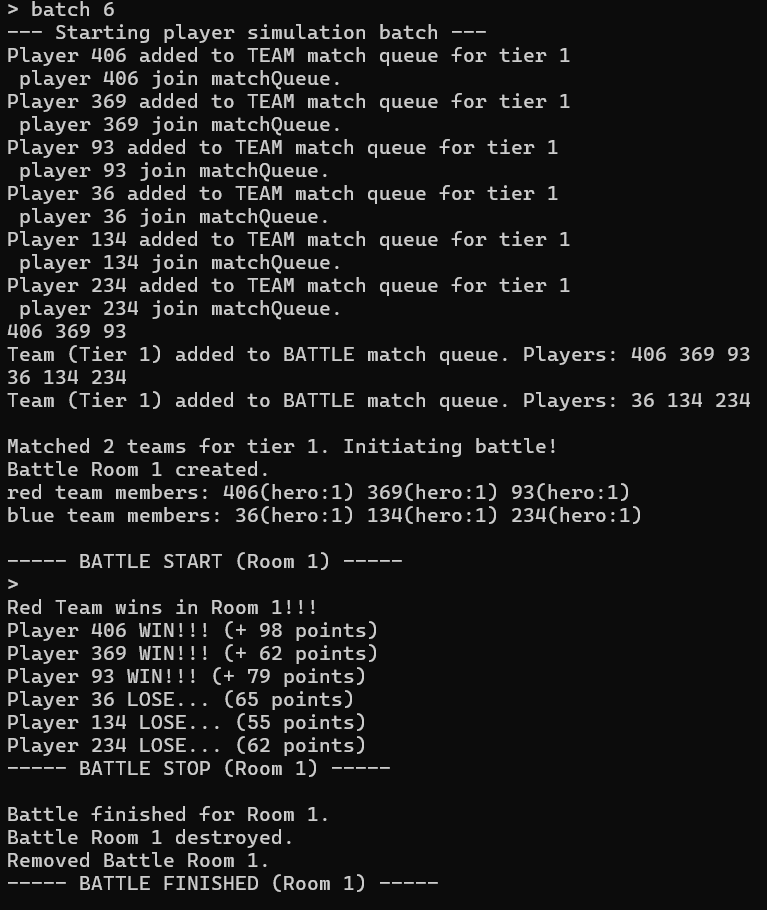
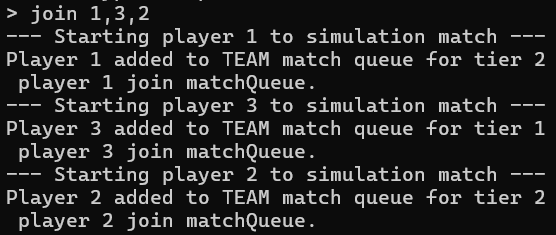
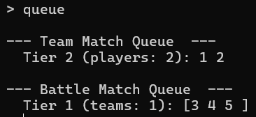
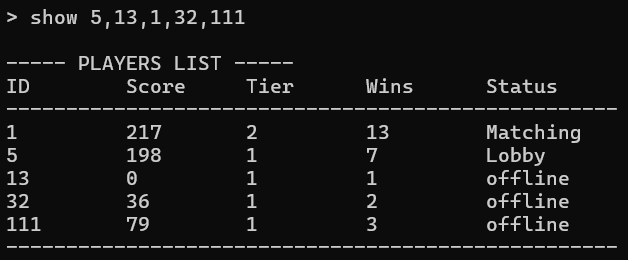
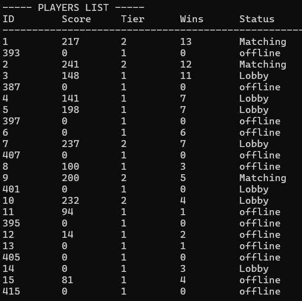
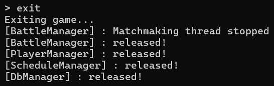

# GameMatchDemo

## Project Overview

**GameMatchDemo** is a simple game matching demo project developed in C++ with multi-threading support, running on Windows 11, and utilizing SQLite3 as its database.
It simulates the entire process of players batching into a matching queue, automatic team formation, entering battles, handling battle results, and saving data.
This project aims to demonstrate the core logic of implementing a matching system, scheduling, player data management, persistent storage, and multi-threaded concurrency.

---
## Project Demo


```
* Launch the demo
```
---

```
* batch <[count]> : Simulate player logins and add them to the matchmaking queue. 'count' is optional (default: 1).
```
---

```
* join <id, [id_2, ...]> : Simulate specific player(s) by ID(s) joining the matchmaking queue. Use '0' for a new player.
```
---


```
* queue : Display the current status of the team matchmaking queue and battle matchmaking queue.
```
---


```
* top <[count]> : Display top players sorted list. 'count' is optional (default: 10).
```
---

```
* show <id, [id_2, ...]> : Display specific player(s) by their ID(s).
```
---


```
* list : Display all players.
```
---

```
* exit : Shut down the game demo.
```
---

## Project Goals

This project serves as a demo of my personal programming capabilities and understanding of server development.
* Demonstrates C++ multi-threading programming and synchronization mechanisms for concurrent operations.
* Core logic includes player creation, state management, a tiered matching system, and database read/write operations.
* Implements data persistence, using SQLite for asynchronous player data reads and writes.
* Features a scheduled task manager for executing background tasks (e.g., periodic database writes).
---
## Runtime Environment
To build and run this project, ensure the following dependencies are installed:

### Required Tools
- **Visual Studio 2022 (or later)**  
  - ✅ C++ Development Workload (`Desktop development with C++`)  
  - ✅ MSVC v143 Build Tools (`v143 platform toolset`)  
  - ✅ CMake (if required)  
  - ✅ Windows SDK (Latest version)  

### Setup Instructions
1. **Install Visual Studio** if not already installed.
2. **Modify installation via Visual Studio Installer**:
   - Open **Visual Studio Installer**.
   - Select **Modify** → **Workloads** → ✅ **Desktop development with C++**.
   - Go to **Individual Components** and ensure ✅ **MSVC v143** is selected.
3. **Clone the repository** and open the project in Visual Studio.
4. **Select the correct Platform Toolset**:
   - Right-click the project → **Properties** → **General** → **Platform Toolset** → Set to `v143`.
5. **Build the project** via `Ctrl + Shift + B` or **Build Solution**.
6. **Verify Installation**:
   - Open the output log, check for any **build errors**.
   - Run the executable to ensure successful compilation.

### Troubleshooting
If the build fails with **MSB8020 (Missing v143 Build Tools)**:
- **Ensure v143 build tools are installed** via **Visual Studio Installer**.
- **Check Windows SDK installation**:
  - Open Visual Studio Installer → Go to **Individual Components** → **Ensure latest Windows SDK is selected**.
- **Try restarting Visual Studio** and rebuilding the project.
---
## Core Features

### Player Manager (PlayerManager)
* Player login/logout mechanisms.
* Manages player online status and in-game states (offline/matching/in-battle/lobby).
* Processes player battle results and updates scores and wins.
* **Asynchronous Write-back:** When player data changes, it's added to a schedule for periodic write-back to the database.

### Battle Match Manager (BattleManager)
* Tier-based matching according to player rank. Includes an automatic team formation mechanism (3v3).
* Creates independent battle rooms (BattleRoom) and battle units (Hero).
* Each room runs a simple simulated battle and result determination on its own thread.
* Battle outcomes (win/loss) are synchronized after the battle concludes.

### Database Manager (DbManager)
* Implements data persistent storage based on the lightweight SQLite database.
* Provides interfaces for Create, Read, Update, and Delete (CRUD) operations on player battle data.
* Ensures database table structures exist upon initialization and loads data into the game.

### Schedule Task Manager (ScheduleManager)
* A general-purpose, multi-thread safe task scheduler.
* Supports both periodic tasks (e.g., player data write-back) and one-time tasks.
---
## Project Structure
```
.
├── include/
│   └── globalDefine.h          # Global definitions
├── libs/
│   └── sqlite/                 # SQLite database library
│       ├── sqlite3.c
│       └── sqlite3.h
├── src/
│   ├── managers/
│   │   ├── battleManager.cpp   # Battle and matching core logic
│   │   ├── battleManager.h
│   │   ├── dbManager.cpp       # SQLite database operation interface
│   │   ├── dbManager.h
│   │   ├── playerManager.cpp   # Player data management
│   │   ├── playerManager.h
│   │   ├── scheduleManager.cpp # Timed task scheduler
│   │   └── scheduleManager.h
│   ├── objects/
│   │   ├── hero.cpp            # Hero class
│   │   ├── hero.h
│   │   ├── player.cpp          # Player class
│   │   └── player.h
│   └── main.cpp                # Application entry point, initializes managers, handles user commands
├── utils/
│   ├── utils.cpp               # Utility functions (time, string processing)
│   └── utils.h
├── README.md
└── README.zh-TW.md
```
---
## TODO List

This project serves as a **proof-of-concept** for a **multithreaded server application**, demonstrating **core functionalities** such as **player management, battle matchmaking, and data persistence**.  
Due to time constraints in development, many **advanced features and best practices** have yet to be fully integrated.  

  * **Graceful Shutdown**

    - Implement a global server state manager to coordinate the shutdown sequence, ensuring smooth termination and data persistence.</details>

  * **Matchmaking**

    - Security : Ensure player state synchronization during matchmaking to maintain data consistency and prevent null pointer issues.
    - Efficiency : Improve efficiency with an event-driven architecture, optimized ranking, and advanced team formation, aiming for O(log N) performance.

  * **Database**

    - Migrate data to MySQL or PostgreSQL, utilizing connection pooling and read/write optimization to handle high concurrency and large data access.</details>

  * **Object Pool**

    - Preallocate objects and reuse them to reduce dynamic memory operations, lowering CPU load and preventing memory fragmentation.</details>

---
## Author

* August Jian (sppaugust@gmail.com)